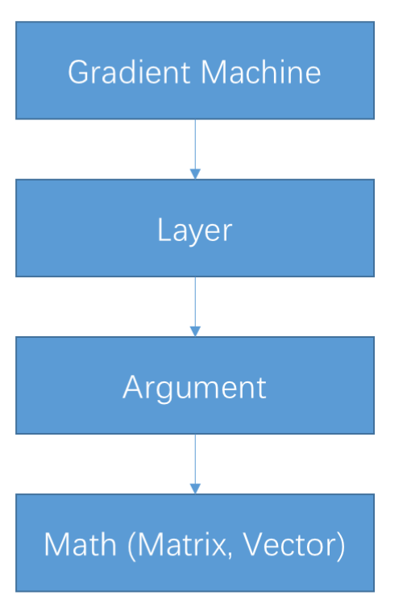

### Outlines
1. Compile the PaddlePaddle core as a dynamic library.
    ```text
    DEST_ROOT=/path/of/capi/
    PADDLE_ROOT=/path/of/paddle_source/
    cmake $PADDLE_ROOT -DCMAKE_INSTALL_PREFIX=$DEST_ROOT \
          -DCMAKE_BUILD_TYPE=Release \
          -DWITH_C_API=ON \
          -DWITH_PYTHON=OFF \
          -DWITH_GPU=OFF \
          -DWITH_SWIG_PY=OFF \
          -DWITH_GOLANG=OFF \
    make
    make install
    ```
2. Serialize the network topology into a protobuf binary file.

    ```bash
    python -m paddle.utils.dump_config \
        train.py '' --binary > train.bin
    ```
3. Write your prediction codes.
 
---
### How to write the prediction codes
- Important concept: **Argument**
    1. Each input (corresponds to a `paddle.layer.data` in network topology) is organized as an `paddle_arguments` object in CAPI.
    2. Essentially, an argument is a struct, the following are then most important data members of an argument, users need to fill these data members to create an input to the network
        - Matrix / Sparse Matrix
        - IVector
        - Sequence Start Position / Sub Sequence Start Position

>NOTE: the above names (Matrix, IVector, etc.) are not the exact names in the codes. Here is to illustrate the concepts.
---

- Import concept: **GradientMachine**
    - A gradient machine includes and manages a group of layers (a sub-network).
    - Every user defined network has at least one network named `root` which is managed by a gradient machine.
    - Forward a gradient machine to get the prediction results.

<p align="center">

</p>

---
- In muti-threaded computing, each compuation thread must have its own gradient machine.
    - Only the trained model is shared by multiple gradient machines:
    
        ```cpp
        paddle_error paddle_gradient_machine_create_shared_param(
                paddle_gradient_machine origin,
                void* modelConfigProtobuf,
                int sizeOfModelProto,
                paddle_gradient_machine* slave)；
    	
        ```

---
1. Organize input data.
   - *Unfortunately, I think this is a confusing part for many users, becasue the underlay data structure is not unified.*
   - Take a dense matrix input as an simple example.
  
   ```cpp
   paddle_arguments in_args = paddle_arguments_create_none();

   // Create input matrix.
   paddle_matrix mat = paddle_matrix_create(
      /* sample_num */ 10,
      /* size */ 784,
      /* useGPU */ false);

   // Assign the value to mat.
   ...

   CHECK(paddle_arguments_set_value(in_args, 0, mat));
   ```
---
- The data structure for differen types of input data type:
    1. Matrix
        - dense matrix (supports CPU/GPU)
        ```cpp
        paddle_matrix paddle_matrix_create(uint64_t height,
                                           uint64_t width,
                                           bool useGpu);
        ```
        - sparse matrix (use CSR/CSC format, support CPU/GPU)
        ```cpp
        paddle_matrix paddle_matrix_create_sparse(
            uint64_t height, uint64_t width,
            uint64_t nnz, bool isBinary, bool useGpu);
        ```
    2. IVector (integer vector)
        ```cpp
        paddle_ivector paddle_ivector_create(int* array,
                                             uint64_t size,
                                             bool copy,
                                             bool useGPU);
        ```
---
3. Sequence/Sub Sequence Start Positions
    ```cpp
    paddle_error paddle_arguments_set_sequence_start_pos(
        paddle_arguments args,
        uint64_t ID,
        uint32_t nestedLevel,
        paddle_ivector seqPos)
    ```
---
- The data structure for differen types of input data type:

Python End  | CAPI end
:-------------: | :-------------:
integer_value  | IVector
dense_vector  | Matrix
sparse_binary_vector | Cpu/Gpu Sparse Matrix (None Value)
sparse_vector | Cpu/Gpu Sparse Matrix (With Value)

---

Python End  | CAPI end
:-------------: | :-------------:
integer_value_sequence  | IVector with Sequence Start Positions|
dense_vector_sequence  | Matrix with Sequence Start Positions|
sparse_binary_vector_sequence | Cpu/Gpu Sparse Matrix (None Value) with Sequence Start Positions|
sparse_vector_sequence |Cpu/Gpu Sparse Matrix (With Value) with Sequence Start Positions|

---
Python End  | CAPI end
:-------------: | :-------------:
integer_value_sub_sequence  |IVector with Sub-sequence Start Positions|
dense_vector_sub_sequence  |Matrix with Sub-sequence Start Positions|
sparse_binary_vector_sub_sequence |Cpu/Gpu Sparse Matrix (None Value) with Sub-sequence Start Positions|
sparse_vector_sub_sequence |Cpu/Gpu Sparse Matrix (With Value) with Sub-sequence Start Positions|


---

2. initialize the PaddlePaddle
    ```cpp
    // Command Line parameters passing to PaddlePaddle
    char* argv[] = {"--use_gpu=False"};
    // Intialize PaddlePaddle environment
    paddle_init(1, (char**)argv);
   ```
---

3. Load the trained model
   ```cpp
   paddle_gradient_machine machine;
   paddle_gradient_machine_create_for_inference(
       &machine,
       config_file_content, content_size));
   paddle_gradient_machine_load_parameter_from_disk(
       machine,
       "./some_where_to_params"));
   ```
---
4. Forward computation
    ```cpp
    // Create the output argument.
    paddle_arguments out_args = paddle_arguments_create_none();
    CHECK(paddle_gradient_machine_forward(
        machine,
        in_args,
        out_args,
        /* isTrain */ false));
    ```
---
5. Clean up.
    ```cpp
    CHECK(paddle_matrix_destroy(prob));
    CHECK(paddle_arguments_destroy(out_args));
    CHECK(paddle_matrix_destroy(mat));
    CHECK(paddle_arguments_destroy(in_args));
    CHECK(paddle_gradient_machine_destroy(machine));
    ```
